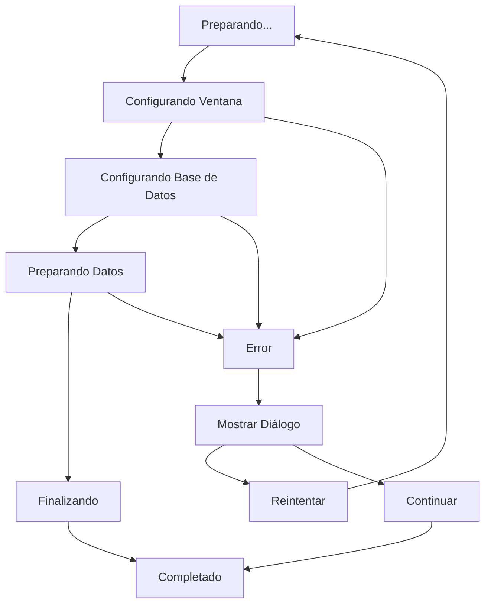

# 🚀 Splash Screen - Implementación Senior

## 📋 Resumen

Implementación profesional de pantalla de carga con animaciones elegantes, seguimiento de progreso en tiempo real y manejo robusto de errores para la aplicación Men Barbería.

## 🏗️ Arquitectura

### Clean Architecture Implementation

```
Presentation Layer
├── SplashScreen (UI + Animations)
└── MainScreen (Target)

Core Layer
├── InitializationService (Business Logic)
└── InitializationState (Data Model)

Services Layer
├── WindowService (Window Management)
└── DatabaseService (Data Persistence)
```

## 🔧 Componentes Principales

### 1. InitializationService (Core Service)

**Ubicación**: `lib/core/services/initialization_service.dart`

**Responsabilidades**:
- Orquestación de todos los servicios de inicialización
- Seguimiento de progreso en tiempo real
- Manejo de errores con estrategias de recuperación
- Patrón Observer para notificaciones de estado
- Logging detallado para debugging

**Características Senior**:
- ✅ Observer Pattern para actualizaciones en tiempo real
- ✅ Weighted Progress Calculation
- ✅ Error Recovery Strategies
- ✅ Service Isolation
- ✅ Comprehensive State Management
- ✅ Debugging Support

### 2. SplashScreen (Presentation Layer)

**Ubicación**: `lib/screens/splash_screen.dart`

**Funcionalidades**:
- Animaciones fluidas con múltiples controllers
- Progreso visual en tiempo real
- Transiciones elegantes
- Manejo de errores con diálogos informativos
- Navegación automática al completar

**Animaciones Implementadas**:
- **Logo Scale & Fade**: Entrada dramática del logo
- **Progress Fade**: Aparición suave de indicadores
- **Pulse Animation**: Efecto de latido durante carga
- **Page Transition**: Transición suave a pantalla principal

## 📊 Estados de Inicialización

### InitializationState Model

```dart
class InitializationState {
  final String currentStep;        // Paso actual
  final String currentDescription; // Descripción detallada
  final double progress;          // Progreso 0.0 - 1.0
  final bool isCompleted;         // Estado de finalización
  final String? error;            // Error si existe
}
```

### Flujo de Estados



## 🎯 Pasos de Inicialización

### Configuración Detallada

| Paso | Título | Descripción | Peso | Duración |
|------|--------|-------------|------|----------|
| 1 | Configurando Ventana | Optimizando tamaño y posición | 1.5 | ~500ms |
| 2 | Configurando BD | Inicializando SQLite | 1.0 | ~300ms |
| 3 | Preparando Datos | Creando tablas | 2.0 | ~400ms |
| 4 | Finalizando | Preparando UI | 0.5 | ~600ms |

### Cálculo de Progreso

```dart
// Progreso ponderado basado en peso de cada paso
double totalWeight = steps.fold(0.0, (sum, step) => sum + step.weight);
double progress = currentProgress / totalWeight;
```

## 🎨 Diseño Visual

### Paleta de Colores

- **Fondo**: Gradiente desde `backgroundColor` hasta `primaryColor`
- **Logo**: `accentColor` (#D4AF37) con sombra dorada
- **Texto Primario**: `textPrimary` (#E0E0E0)
- **Texto Secundario**: `textSecondary` (#B0B0B0)
- **Progreso**: Gradiente de `accentColor`

### Animaciones Timing

```dart
// Logo Animation
Duration: 1500ms
Curve: Curves.elasticOut

// Progress Animation  
Duration: 800ms
Curve: Curves.easeInOut

// Pulse Animation
Duration: 2000ms (repeat)
Curve: Curves.easeInOut

// Page Transition
Duration: 600ms
Curve: Curves.easeOutCubic
```

## 🔄 Manejo de Errores

### Estrategias de Recuperación

#### Errores No Críticos
- **Window Service**: Continúa con configuración por defecto
- **Logging**: Registra error pero no detiene proceso

#### Errores Críticos
- **Database Init**: Detiene inicialización
- **Muestra diálogo**: Opciones de reintentar o continuar

### Diálogo de Error

```dart
AlertDialog(
  title: 'Error de Inicialización',
  content: Text(error),
  actions: [
    'Reintentar' -> reset() + restart,
    'Continuar' -> navigate with degraded functionality
  ]
)
```

## 🚀 Transiciones

### Navegación a MainScreen

```dart
PageRouteBuilder(
  transitionsBuilder: (context, animation, secondaryAnimation, child) {
    return FadeTransition(
      opacity: animation,
      child: SlideTransition(
        position: Tween<Offset>(
          begin: Offset(0.0, 0.1),
          end: Offset.zero,
        ).animate(animation),
        child: child,
      ),
    );
  },
  transitionDuration: Duration(milliseconds: 600),
)
```

## 🧪 Testing Strategy

### Unit Tests Recomendados

```dart
group('InitializationService', () {
  test('should complete all steps successfully', () {
    // Test normal flow
  });
  
  test('should handle window service errors gracefully', () {
    // Test error recovery
  });
  
  test('should calculate progress correctly', () {
    // Test weighted progress
  });
  
  test('should notify listeners of state changes', () {
    // Test observer pattern
  });
});

group('SplashScreen', () {
  testWidgets('should show loading animations', (tester) async {
    // Test UI animations
  });
  
  testWidgets('should navigate on completion', (tester) async {
    // Test navigation
  });
  
  testWidgets('should show error dialog on failure', (tester) async {
    // Test error handling
  });
});
```

### Integration Tests

- Verificar inicialización completa end-to-end
- Validar animaciones y transiciones
- Confirmar manejo de errores de red/permisos
- Probar en diferentes resoluciones de pantalla

## 📱 UX Considerations

### Desktop-First Design

- **Tamaño Óptimo**: Diseñado para ventanas grandes
- **Animaciones Suaves**: 60fps garantizado
- **Feedback Visual**: Progreso claro y detallado
- **Error Recovery**: Opciones claras para el usuario

### Accessibility

- **Contrast Ratios**: Cumple WCAG 2.1 AA
- **Text Scaling**: Soporta escalado del sistema
- **Keyboard Navigation**: Navegable con teclado
- **Screen Readers**: Textos descriptivos

## 🔧 Configuración de Desarrollo

### Para probar la pantalla de carga:

```bash
# Ejecutar con hot reload
flutter run -d macos --hot

# Para simular carga lenta (debugging)
# Modificar delays en InitializationService
```

### Debugging Tips

```dart
// Habilitar logs detallados
debugPrint('InitializationService: ${step.id} completed');

// Monitorear estado en tiempo real
initService.addListener((state) {
  print('Progress: ${state.progress * 100}%');
});
```

## 🚨 Troubleshooting

### Problemas Comunes

| Problema | Causa | Solución |
|----------|-------|----------|
| Animaciones lentas | Muchos rebuilds | Usar RepaintBoundary |
| Carga muy rápida | Delays muy cortos | Aumentar delays mínimos |
| Error de navegación | Context inválido | Verificar mounted |
| Memoria alta | Animaciones no disposed | Llamar dispose() |

### Performance Optimization

```dart
// Usar const constructors
const SplashScreen()

// RepaintBoundary para animaciones
RepaintBoundary(child: animatedWidget)

// Dispose controllers
@override
void dispose() {
  _logoController.dispose();
  _progressController.dispose();
  super.dispose();
}
```

## 🔄 Futuras Mejoras

- [ ] Preload de assets críticos durante splash
- [ ] Animaciones personalizables por tema
- [ ] Splash screen adaptativo según resolución
- [ ] Métricas de tiempo de carga
- [ ] Cache de inicialización para arranques rápidos

## 📚 Referencias

- [Flutter Animations Guide](https://docs.flutter.dev/development/ui/animations)
- [Material Design - Launch Screens](https://material.io/design/communication/launch-screen.html)
- [animate_do Package](https://pub.dev/packages/animate_do)
- [Observer Pattern](https://refactoring.guru/design-patterns/observer)
