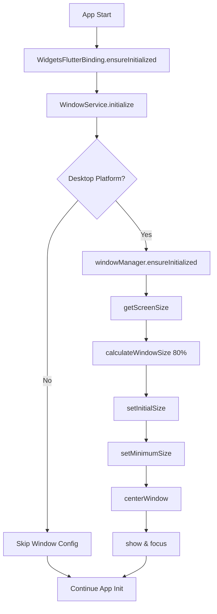

# 🖥️ Window Management - Implementación Senior

## 📋 Resumen

Implementación de gestión avanzada de ventanas para aplicación de escritorio con configuración automática del 80% del tamaño de pantalla como mínimo no reducible.

## 🏗️ Arquitectura

### Clean Architecture Implementation

```
Presentation Layer
├── WindowInfoWidget (Debug UI)
└── MainScreen (Integration)

Core Layer
├── WindowService (Business Logic)
└── IWindowService (Interface)

Platform Layer
├── window_manager (Flutter Plugin)
├── screen_retriever (Screen Detection)
└── MainFlutterWindow.swift (Native macOS)
```

## 🔧 Componentes Principales

### 1. WindowService (Core Service)

**Ubicación**: `lib/core/services/window_service.dart`

**Responsabilidades**:
- Detección automática de resolución de pantalla
- Configuración de tamaño mínimo (80% de pantalla)
- Manejo de errores y fallbacks
- Singleton pattern para consistencia
- Logging detallado para debugging

**Características Senior**:
- ✅ Interface Segregation Principle
- ✅ Dependency Inversion
- ✅ Error Boundary Pattern
- ✅ Fallback Strategy
- ✅ Platform Detection
- ✅ Comprehensive Logging

### 2. Native macOS Configuration

**Ubicación**: `macos/Runner/MainFlutterWindow.swift`

**Funcionalidad**:
- Override de `constrainFrameRect` para restricciones nativas
- Cálculo dinámico del 80% de pantalla
- Validación de límites de pantalla
- Centrado automático cuando sea necesario

### 3. Debug Widget

**Ubicación**: `lib/widgets/debug/window_info_widget.dart`

**Características**:
- Solo visible en modo debug
- Información en tiempo real de la ventana
- Refresh manual de datos
- UI expandible/colapsable

## 📐 Especificaciones Técnicas

### Tamaños de Ventana

| Configuración | Valor | Descripción |
|---------------|-------|-------------|
| Tamaño Inicial | 80% de pantalla | Calculado dinámicamente |
| Tamaño Mínimo | 80% de pantalla | No reducible |
| Fallback Mínimo | 1200x800px | Si falla detección |
| Máximo | 100% de pantalla | Limitado por OS |

### Comportamiento por Plataforma

| Plataforma | Implementación | Estado |
|------------|----------------|--------|
| macOS | Native Swift + Flutter | ✅ Completo |
| Windows | Flutter Plugin | ✅ Completo |
| Linux | Flutter Plugin | ✅ Completo |
| Web | No aplicable | N/A |
| Mobile | No aplicable | N/A |

## 🚀 Flujo de Inicialización



## 🔍 Debugging

### WindowInfoWidget

En modo debug, aparece un widget en la esquina superior derecha que muestra:

- **Platform**: Sistema operativo actual
- **Supported**: Si window management está soportado
- **Size**: Dimensiones actuales de ventana
- **Position**: Posición en pantalla
- **Visible**: Estado de visibilidad
- **Focused**: Estado de foco
- **Initialized**: Estado de inicialización

### Logs de Debug

```dart
// Ejemplos de logs generados
WindowService: Successfully initialized for macOS
WindowService: Window configured - Size: 1536.0x864.0
WindowService: Fallback configuration applied
```

## 🧪 Testing Strategy

### Unit Tests Recomendados

```dart
// Ejemplo de test structure
group('WindowService', () {
  test('should calculate 80% of screen size correctly', () {
    // Test implementation
  });
  
  test('should fallback to minimum size on error', () {
    // Test implementation  
  });
  
  test('should handle platform detection correctly', () {
    // Test implementation
  });
});
```

### Integration Tests

- Verificar que la ventana se abre con el tamaño correcto
- Confirmar que no se puede reducir por debajo del 80%
- Validar comportamiento en múltiples resoluciones

## 📦 Dependencias

```yaml
dependencies:
  window_manager: ^0.3.7    # Window management
  screen_retriever: ^0.1.9  # Screen detection
```

## 🔧 Configuración de Desarrollo

### Para ejecutar con window management:

```bash
# Instalar dependencias
flutter pub get

# Ejecutar en desktop
flutter run -d macos
flutter run -d windows
flutter run -d linux
```

### Verificar funcionamiento:

1. La aplicación debe abrir al 80% del tamaño de pantalla
2. No debe permitir reducir el tamaño por debajo de este límite
3. En modo debug, el widget de información debe mostrar datos correctos

## 🚨 Troubleshooting

### Problemas Comunes

| Problema | Causa | Solución |
|----------|-------|----------|
| Ventana muy pequeña | Fallo en detección de pantalla | Se aplica fallback 1200x800 |
| No se puede redimensionar | Restricciones nativas activas | Comportamiento esperado |
| Widget debug no aparece | Modo release activo | Solo funciona en debug |

### Logs de Error

```dart
WindowService: Initialization failed - PlatformException
WindowService: Configuration failed - Invalid screen size
WindowService: Fallback configuration also failed
```

## 🔄 Futuras Mejoras

- [ ] Soporte para múltiples monitores
- [ ] Configuración personalizable del porcentaje
- [ ] Persistencia de posición de ventana
- [ ] Animaciones de redimensionado
- [ ] Temas específicos para diferentes tamaños

## 📚 Referencias

- [window_manager Plugin](https://pub.dev/packages/window_manager)
- [screen_retriever Plugin](https://pub.dev/packages/screen_retriever)
- [Flutter Desktop Best Practices](https://docs.flutter.dev/desktop)
- [Clean Architecture Principles](https://blog.cleancoder.com/uncle-bob/2012/08/13/the-clean-architecture.html)
